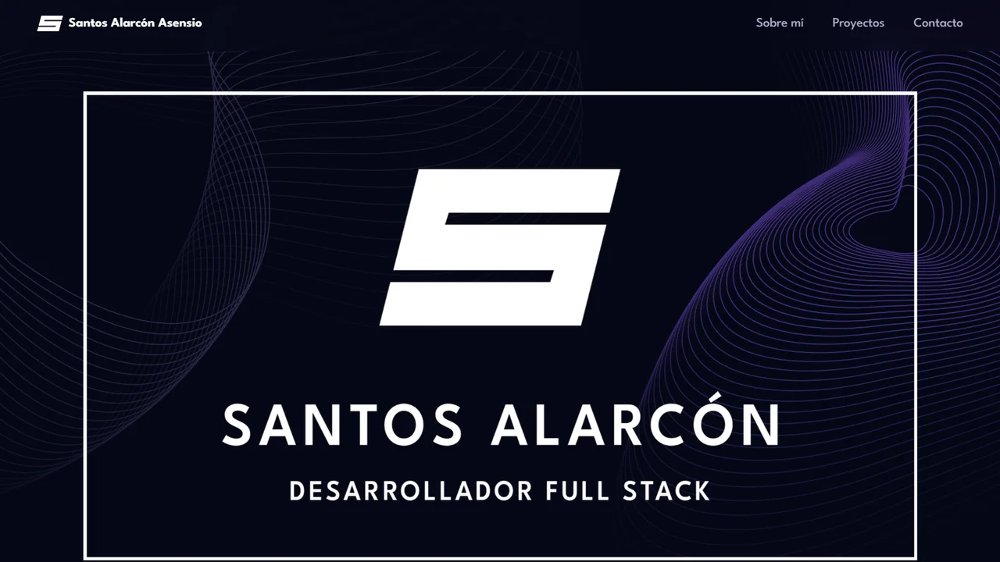

# 3DPortfolio

Este es un portfolio con elementos en 3D usando las librerías **Three.js** y **React Three Fiber** para renderizar elementos 3D. Estoy pensando en usar este portfolio a nivel personal conforme vaya adquiriendo experiencia profesional y desarrollando proyectos por cuenta propia.

El proyecto está alojado en **Vercel** para que la gente lo pueda ver. Cualquier cambio que se efectue en el repositorio, éste se verá reflejado al instante en producción tras su despliegue.

El origen de este proyecto proviene de un tutorial en inglés del canal de [JS Mastery](https://www.youtube.com/@javascriptmastery)
